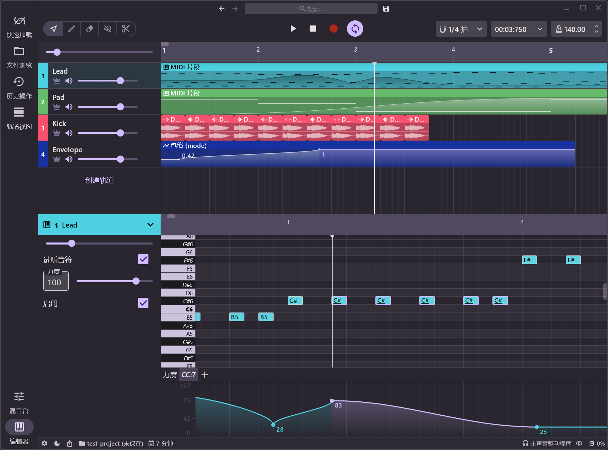

# Echo In Mirror [](https://github.com/EchoInMirror/EchoInMirror/actions/workflows/release.yml)   

An open source DAW (Digital Audio Workstation) written in pure Kotlin.

## Screenshots



## Features

- [x] VST/VST3/AU plugin support
- [x] Audio effects
- [x] Audio sample support
- [x] ASIO support
- [x] MIDI edit
- [x] Latency compensation
- [x] Audio edit
- [ ] Audio recording
- [ ] Midi input
- [ ] Plugin api
- [ ] CLAP and ARA plugin support
- [ ] Android support
- [ ] iOS support

## Requirement

- Java 21

## Build

```bash
git clone https://github.com/EchoInMirror/EchoInMirror.git

cd EchoInMirror

gradlew :daw:shadowJar
```

## Run

```bash
java --enable-preview -jar daw/build/libs/daw.jar
```

## Author

Shirasawa

## License

[AGPL-3.0](./LICENSE)
